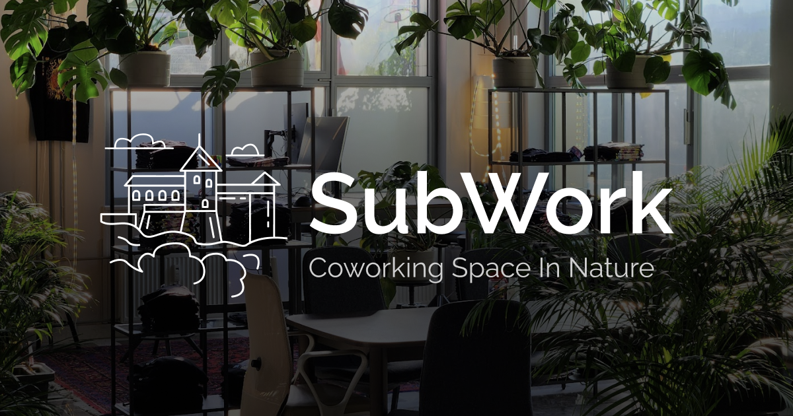

# subwork - coworking in nature

[web3 coworking in nature, located at Julian Alps, Bled, Slovenia](https://subwork.xyz)



Getting started
---
If you want to contribute to this repository check out the issues or submit an issue.

`package.json` is in docs, as multiple deployments might be integrated in the future

To contribute to the code fork the repository, clone it by running `git clone` and run:

```
cd docs
pnpm install
pnpm run docs:dev
```

Checkout if your code builds:
```
pnpm run docs:build
```


Temporary deployment
---
Till we migrate off Notion to Vitepress
- https://subwork.netlify.app

Visiting SubWork
---
Want to come visit us? 
Feel free make pull-request to [booking.md](booking.md) and notify us on telegram channel with your PR.


Leave us Review
---
Did you love to work at our place? 

**If yes**, [please leave us review on Google Maps](https://goo.gl/maps/sabvduMGJ2JHDGGL8).

Every review helps SubWork be closer to sustainable bussines model.
