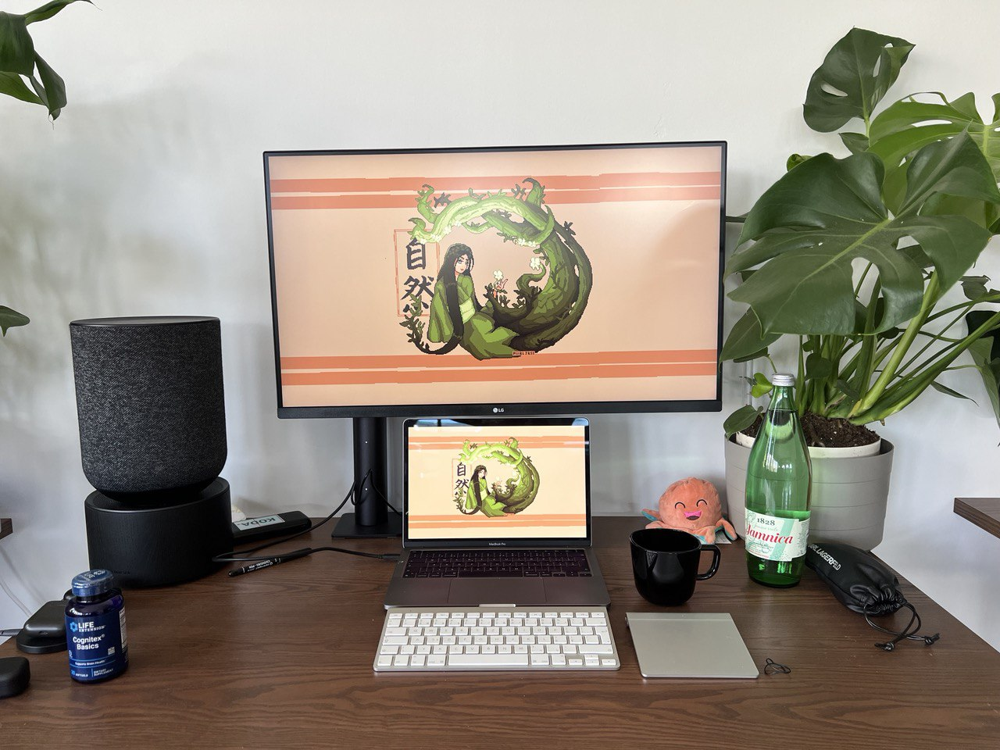
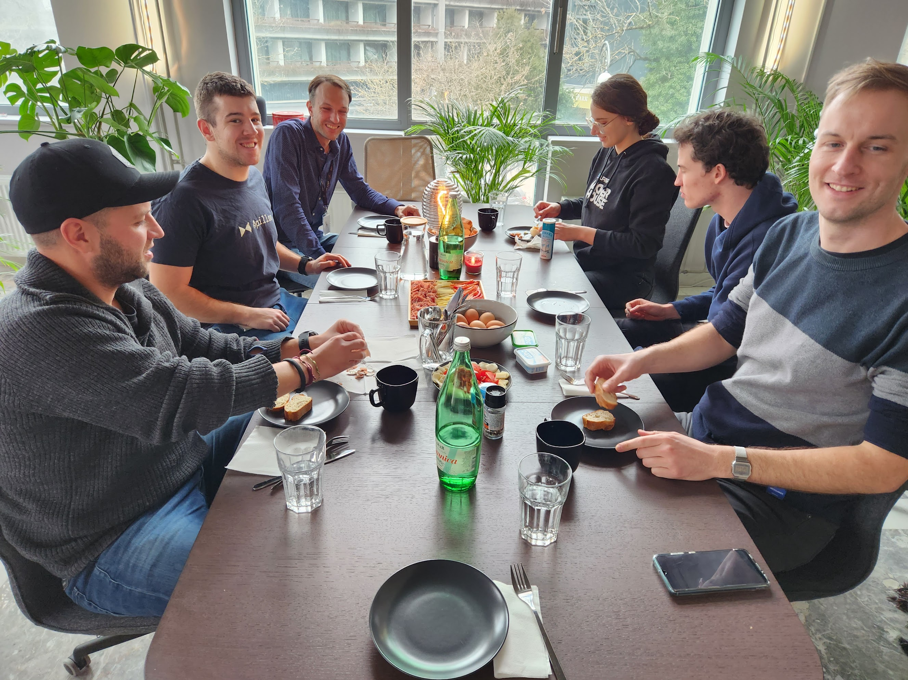
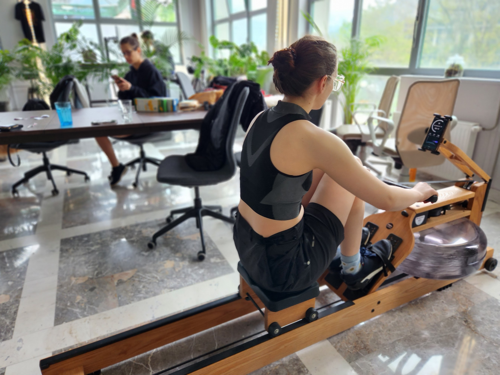
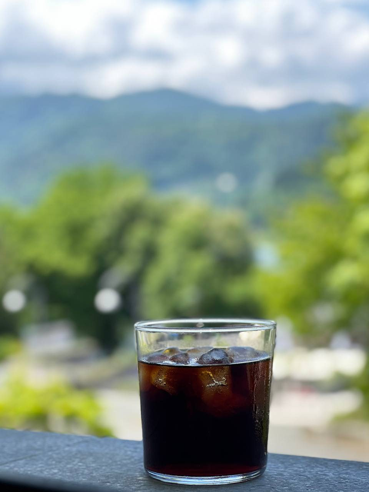

# Amenities

> speciality coffee lovers doing daily grind

type of areas we have in SubWork
---

> picture of premier lounge area to secure your milion $ tickets
- space for focused work
- space for collaborative work
- space for relaxation
- space with bar seating
- all areas are accousticially insulated for your silent comfort
- lounge areas for executive meetings

premium objects in space
---

> picture of good looking goatstory dripper in sunlight 

- lot of plants 
  - over 30 and counting
- 4K 32" USB-C monitors 
  - plenty screen real estate for your grind and gpt outputs
- standing desk
  - we don't like back-pain either
- ultra-fast optic fibre gigabit Internet
  - downloading big LLM models for your AI startup or syncing big blockchain?
  - industry standard wi-fi coverage by Ubiquiti
- podcasting equipment
  - for your new video episodes
  - [two studio high-performance gamer microphones](https://hyperx.com/products/hyperx-quadcast-s-usb-microphone?variant=41031692058781)
  - [streamcam w/ 1080p AF](https://www.logitech.com/en-ch/products/webcams/streamcam.960-001281.html)
  - ring lights
- shower
  - are you feeling sporty and want finish your morning workout in SubWork? We've got shower in space!
  - want some shower thoughts before entering into deep work focus window?

community social events on regular basis
---
- We are organizing events on infrequent basis, we reccomend you better [subscribe to our Meetup group](https://www.meetup.com/subwork/) to be informed ahead.

> lot of folks on our first polkadot mini-conf

> we had lot of public breakfast in past with local friends

> casual wine & drinks after meeetups

micro gym in coworking space
---

we feel sporty everyday and to keep up our development pace fast. We will help to build athletic mentality.
- pull-up bar 
- [WaterRower Rowing Machine](https://www.nohrd.com/us/waterrower/)
- [Abdominal Trainer, Back Extension Bench and Weight Bench](https://www.nohrd.com/us/triatrainer/)

flexible
---

> statsh of bikes 

- on-site support 
  - your code doesn't build? We have experts in Rust, Typescript, Vue, Substrate, Solidity
- bicycle-friendly
  - you can come to SubWork on bike!
- crypto-enabled
  - place on earth where price talk is allowed
- air-conditioning
  - right working temperature

drinks 
---

> picture of cold brew 
> picture of very cold club mate, imagine.

- speciality coffee bean bags
  - equipment like frenchpress and commandante grinder
- club-Mate
  - we love berlin style
- chai latte 
  - we have lot of various brands of chai latte powders and syrup
- wine
  - have closed seed-round and you need some chill?
- tea and matcha

services
---

> picture of delivered package waiting for you to unbox

- package handling 