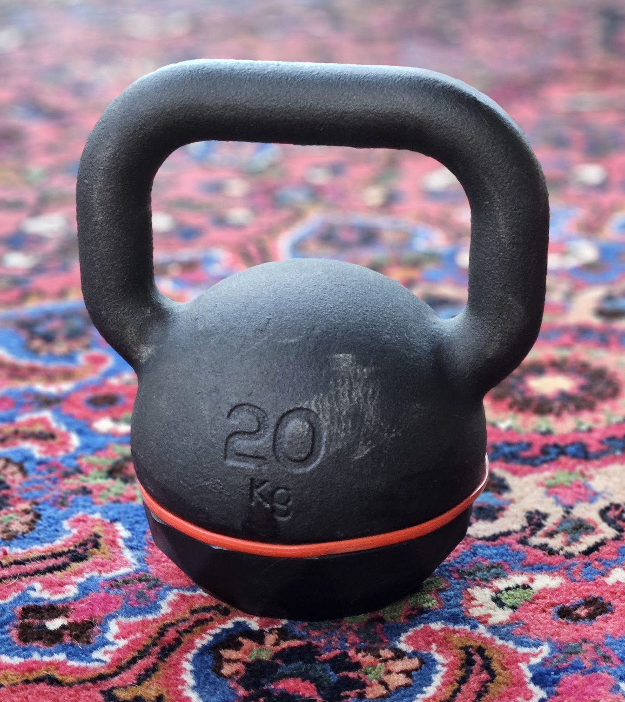

# Basic gym equipment in coworking Space SubWork

Why it's important for us to have gym at coworking space?
---

- **Promotes well-being:** Providing gym equipment in a coworking space can encourage members to take breaks and engage in physical activity, which can improve their overall well-being and reduce stress.
- **Attracts health-conscious clients:** Offering gym facilities can make our coworking space more appealing to clients who value their health and fitness.
- **Increases productivity:** Regular exercise can help improve focus and energy levels, which can lead to increased productivity for coworking space members.

List of gym equipment
---
- kettlebells - 6kg, 12kg and 20kg
- dumbbells - two times 5kg & two times 10kg
- [multi-functional workout bench - TriaTrainer](https://www.nohrd.com/us/triatrainer/) to train your abdominal muscles, your back and glute.
- [water rower](https://www.nohrd.com/us/waterrower-performance/) - with precise rowing data
- yoga mat
- resistance bands
- jump rope