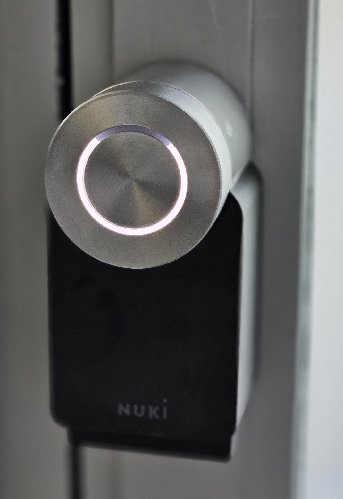

# Book your stay at Coworking SubWork

> our experimental cyber-receptionist

We are always want to make space more autonomous and less hassle free so onboarding can be seamless as much coming to your own home.

We are running experimental mode where you can book your stay at SubWork Coworking Space ahead of your visit 24/7, in any of day in week. Yes even on weekends! We are traveling to conferences or vacations too, yet we are happy to offer our space whenever we are away and not at home. In year 2023 we had 30+ potential visits, yet we aren't in space and able to give access to space.

How to book space?
---
Right now it's good to visit our [**Telegram - SubWork Bled**](https://t.me/+VoZsr7MEds84ZjQ0) and ask for your stay with dates. We will create you temporary access remotely. Mind it's needs to be done bit ahead, we reccommend at least 24h, yet sometimes we can respond under 1h if you are lucky.

Future booking space
---
We envision you would be able to pay for your stay ahead with returnable deposit (_300e_), use space like take call, have your productive joyful window, take unlimited amount of calls and when your work is done, leave space tidy as you found it :D

Why I need to pay deposit?
---
As we and coworkers have lot of valuable goods in space, we are happy to give you access to comfortable do your work, yet as line of trust people we don't know IRL and their reputation, we set barrier, where we think if something would go bad in the space, should cover partially damage done. This should filter out most of bad actors in case and let only people with good intention inside. Deposit is usually returned after checkup of space in less than 7-14 days.
We are working on this way to have it soon as possible and with more recognized and frequent coworkers we can completely remove deposit. 

First time in SubWork
---
Hello, whenever it is your first time at SubWork, [we've prepared easy onboarding in case you will have questions.](./first-time-in-subwork.md)

Availability Calendar
---
<booking_system_with_beautiful_availability_calendar_of_meeting_rooms>

<booking_system_with_beautiful_availability_calendar_of_flex_desks>
