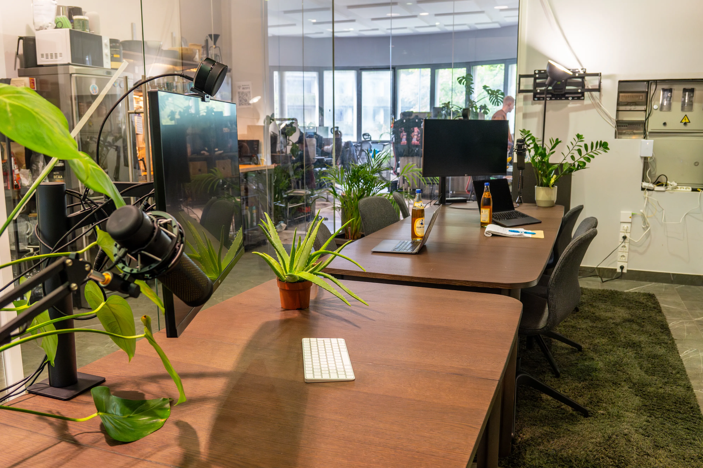
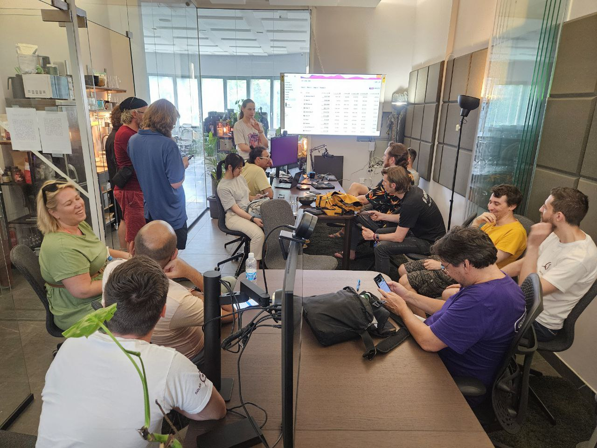
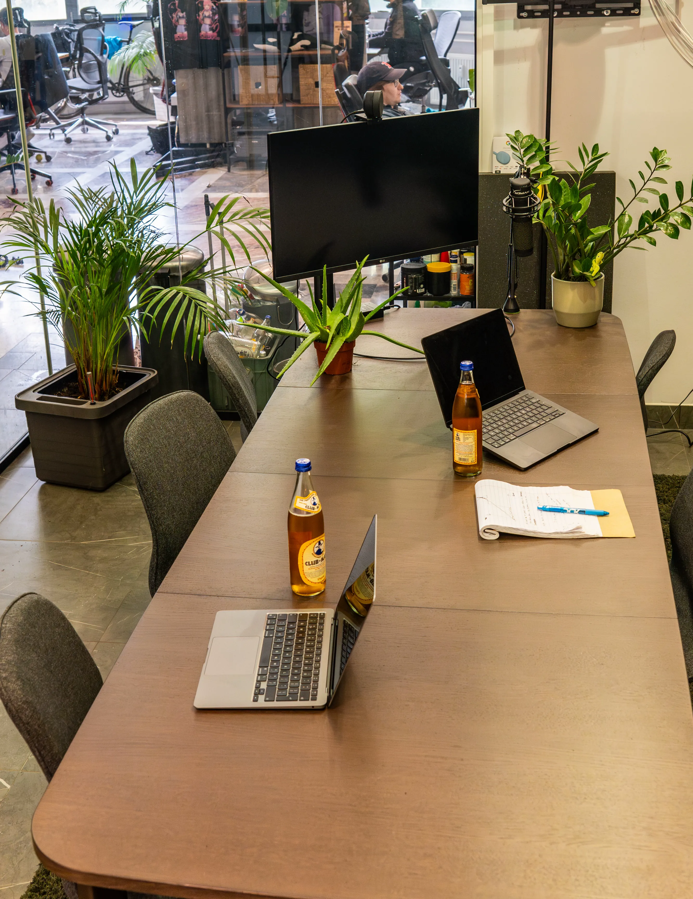
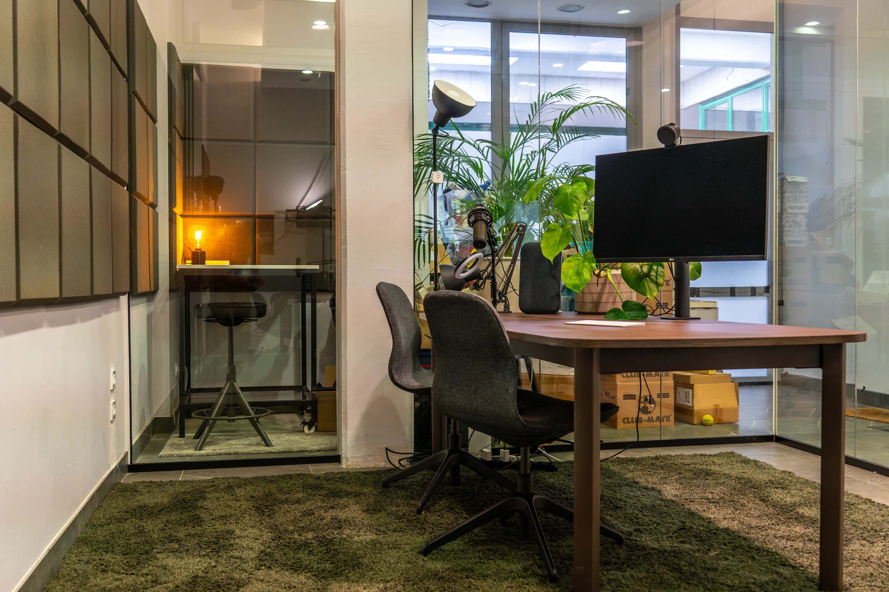

# Book Meeting room in Bled

In SubWork, we know that in remote work, you want a peaceful place to lead team standups, discuss ongoing tasks within your remote team with colleagues, or have essential business 1-1 calls with your partners in your startup. 

No matter what kind of business you do on the Internet, we can help you deliver and make your call from our space a pleasant experience without struggle. In a calm environment, you can focus on your essentials to experience the peak of your productivity.

Are you looking for the perfect place to brainstorm and meet clients in Bled? We are your place to experience with local builders to ask for advice. 

We can guarantee flawless calls with our high-quality, high-speed optical gigabit internet and coverage from industrial leader Ubiquiti.

## **Want to book your meeting room now?** 

Feel free to contact us on [Telegram 🤙](./contact.md). We will try our best.

Ethereum room
---
- 8-10 seats
- external monitor 32" USB-C and HDMI
- acoustically insulated with panels and beautiful carpet
- high-performance studio microphone
- 75" telly for your brainstorming sessions equipped with ChromeCast
- 50€/h

Rollup room
---
- 4-6 seats
- external monitor 32" USB-C and HDMI
- acoustically insulated with panels and beautiful carpet
- podcasting equipment with high-performance gaming microphone for crispr sound for meetings
- ring light for perfect light for your YouTube/TikTok video recordings
- 50€/h

solo chain - private calling booth
---

<picture_of_calling_booth>
- acoustically insulated corner
- high privacy
- external monitor 32" usb-c and HDMI<Badge type="tip" text="soonTM" />
- good for focusing and close collaboration on startups

