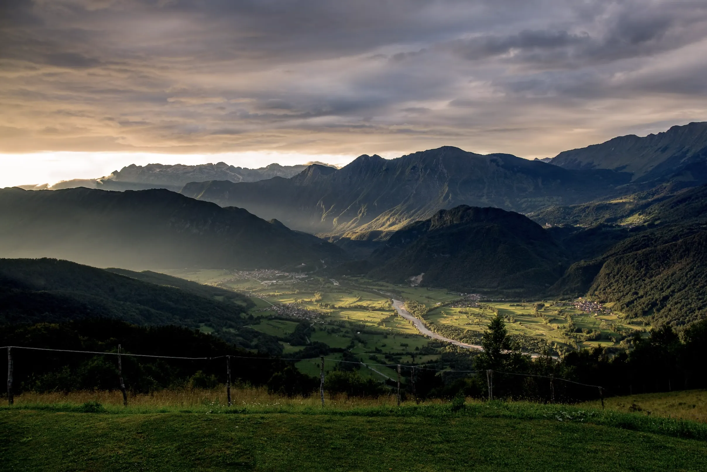

## Company retreat for team building at Bled

Are you looking for **space for your company retreat** where you can set your team building for your remote-first company or brainstorm new ideas for your products? 
We are your perfect place to be! 
**[Reach out us on Telegram](./contact.md)** and we can discuss details in DMs!

Testimonials from companies whose appreciated moments at SubWork
---
- [Apillon](https://apillon.io/) - Slovenian web3 company bringing web2 experience for developers 
- [Koda](https://koda.art) - Generative Art Marketplace and [number one dapp in Polkadot ecosystem by Github](https://github.com/topics/polkadot?o=desc&s=forks)
- [Lastic](https://www.lastic.xyz/) - blockspace marketplace for data availibility solutions
- [Basilisk](https://bsx.fi/) - Basilisk brings permissionless liquidity to Kusama.
- [HydraDX](https://hydradx.io/) - An Ocean of Liquidity for Polkadot   
- [Swarm](https://www.ethswarm.org/) - Hosted po SwarmConference team moments
- [Celestia](https://celestia.org/)

Held retreats on Bled
---
- [MakerDAO](https://makerdao.com/en/)
- [Oasis Network](https://twitter.com/OasisProtocol/status/1668298511295856640) 
  > the Oasis team traveled from around the globe for our company retreat in Bled, Slovenia.
- [CalCom](https://www.linkedin.com/posts/cal-com_as-a-remote-and-fully-async-company-we-activity-7219994210949615618-9ILi/)
- and probably many other cool companies we are not aware coming to Bled

Conference venues in Bled
---
- Currently there are [15+ congress venues you can directly book in Bled](https://www.bled.si/en/meetings/meeting-planning/venues/)
- [Rikli Balance Hotel - 350+, 8 conference halls, various setups](https://www.bled.si/de/meetings/meeting-planning/venues/2020090714580355/rikli-balance-hotel-s/)
- [Why to choose Bled?](https://www.bled.si/de/meetings/)
- [References for international events in Bled](https://www.bled.si/de/meetings/why-bled/references/)
- [Upcoming world meetings](https://www.bled.si/en/events/?start=01.01.1900&end=31.12.2023&lng=eng&filter%5B%5D=2020082609001927)
- [InSync Team Buildings](https://www.insync.si/)