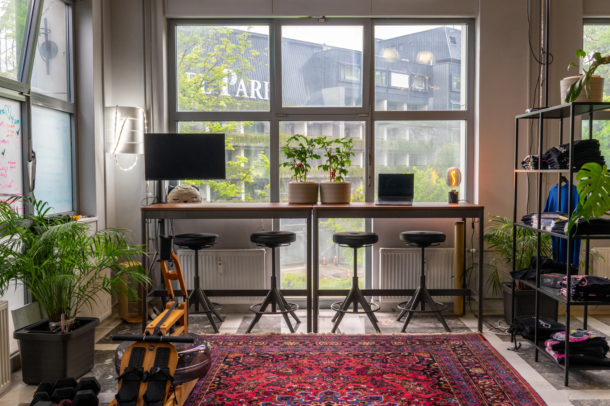
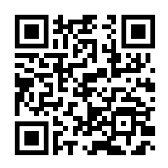

---
head:
  - - meta
    - property: og:type
      content: website
  - - meta
    - property: og:title
      content: SubWork - coworking in nature
  - - meta
    - property: og:image
      content: https://subwork.xyz/subwork_header.png.webp
  - - meta
    - property: og:url
      content: https://subwork.xyz
  - - meta
    - property: og:description
      content: Beautiful coworking space in nature of Julian Alps in Bled, Slovenia
  - - meta
    - name: twitter:card
      content: summary_large_image
---

# Contact SubWork before your first visit

- _Are you curious?_ Come to ask question to our group [**Telegram - SubWork Bled**](https://t.me/+VoZsr7MEds84ZjQ0) 
  > join over 200 members


> come to enjoy view

📥  Subscribe for updates
---

- [/subwork @ Farcaster](https://warpcast.com/~/channel/subwork) 
   > over 100 people on decentralized media are subscribed to SubWork updates
- [x.com/@SubWorkBled](https://x.com/subworkbled)
   > over 400 people on X are subscribed to SubWork updates
- [upcoming community meetups](https://www.meetup.com/subwork/)


📍 Location
---
- [Directions to SubWork](https://goo.gl/maps/VHcaWbhwAV77KgTX9)
- [Where is SubWork located?](./location-of-subwork.md)


⭐️ Leave Us Review
---
Have you been to our place recently? We would love to have your five-star review! Please **share your review** to let others know about this fantastic coworking in nature.



- [Five-star review on Google Maps](https://g.page/r/CWs7EEKFN9-zEBM/review)
- [Coworker Review](https://www.coworker.com/slovenia/bled/subwork)
- [CoworkBooking Review](https://www.coworkbooking.com/europe/slovenia/subwork)
- [CoworkMaps Tags](https://coworkmaps.com/city/bled)

🧾 Invoice
---

Invoicing details for SubWork suppliers

```
GenArt, Matej Nemček s.p.
Proletarska cesta 4
1000 Ljubljana
Slovenia, Europe
Company No.: 8976732000
VAT: SI83616110
```

```
Genesis Art d.o.o.
Genesis Art, digitalizacija umetnosti, d.o.o.
Ljubljanska cesta 4
4260 Bled
Slovenia, Europe
Company No.: 9647287000
VAT: SI72862980
```