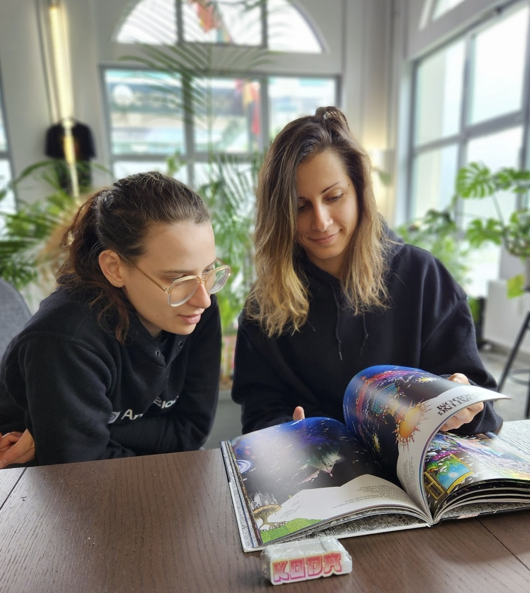

# Family Members in SubWork

Current coworkers are among top class web3 startups and AI experimentators

companies
---
- developer from [hydradx](https://hydradx.io/) and [basilisk](https://bsx.fi/)
- founders of [kodaDot - most popular open source nft marketplace](https://kodadot.xyz)
  - [yangwao](https://twitter.com/yangwao)
  - [vikiival](https://twitter.com/vikiival)
- [poppyseedDev](https://twitter.com/poppyseeddev) doing her Rust courses, recently got accepted to Polkadot Blockchain Academy at Berkley, US
- various fund managers
- hotdesking clients among local family office
- regional and neighbourhood corporate members

brogrammers
---

say hello to our awesome coworkers and enjoy000rs of Bled

<VPTeamMembers size="medium" :members="members" />