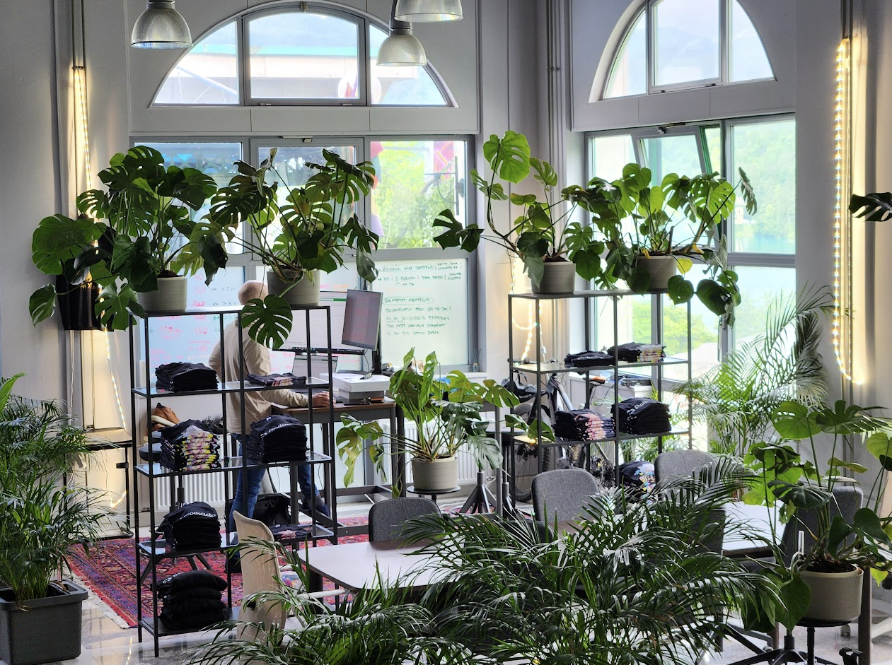

# First time in SubWork

You are already in our coworking space and want to get more familiar with stuff. This is quick brief when no-one is around available help you in person as they might be busy or enjoying sports in nature.

Welcome
---
We would likely warmly welcome in our space and we are happy that you choose to come to our space! 

Storyline
---
Our space started as wild adventure of KodaDot founders and [after spending year here, we double down opening web3 cowork here](./why-did-we-choose-bled.md) and make it our HQ and happy share with digital nomads as we are same blood type and travel around hackathon and conferences and choose Bled as our homebase where **we can recharge & recover fast**.

More about you
---
We are always curious, where did you heard first time about SubWork? Feel free share more in our Telegram and get connected with [our community of current & past coworkers](./contact.md).

Motivation
---
We are always curious, where are you coming from to our place in middle nowhere? What's your motivation to show up? We are happy to [vibe with you at our channel](./contact.md)

Meeting Rooms
---
Once you are in our space, we have availibility of our [meeting rooms](./book-meeting-room-bled.md), we offer tables hot desks and collaboration corners to use. If none of tables is specially marked and clean, it means it's available for you to utilize and being productive. 

Wifi
---
password could be find on walls by scanning QR code. Other equipment like printer we have in case you want to print something. 

Kitchen
---
is free to use, have a glass water or if you are familiar with speciality gear, feel free to use one. If you are staying longer, we are more than happy show you how to use it, our local barista Viki will show you quick lesson how to. We have gear from local Slovenian folks Goat and we have numerous bean bags where we supply coffee beans.

Are you thirsty? 
---
We have refrigerated beverages like Club-Mate, Club-Mate Cola, non-alcoholic beer and other drinks depends on availability for you in fridge in the space. On the fridge is self-service terminal, where you can tap it and enter amount, current usual price is flat 2€ to support space and operations. 

Rules
---
Respect fair usage policy and [have a read of our rules of space](./rules-for-coworkers.md), if you are great nomad, we've bet you already know them all and well behaved person.

Want to come and no-one is around?
---
We travel too and we are more than happy make this space autonomous. To offer space as public good for anyone coming, it needs to make sustainable returns and we can manage to pay rent. If you can deposit us ahead small amount like 100e we are happy to share access with you. Otherwise there is always members on site.