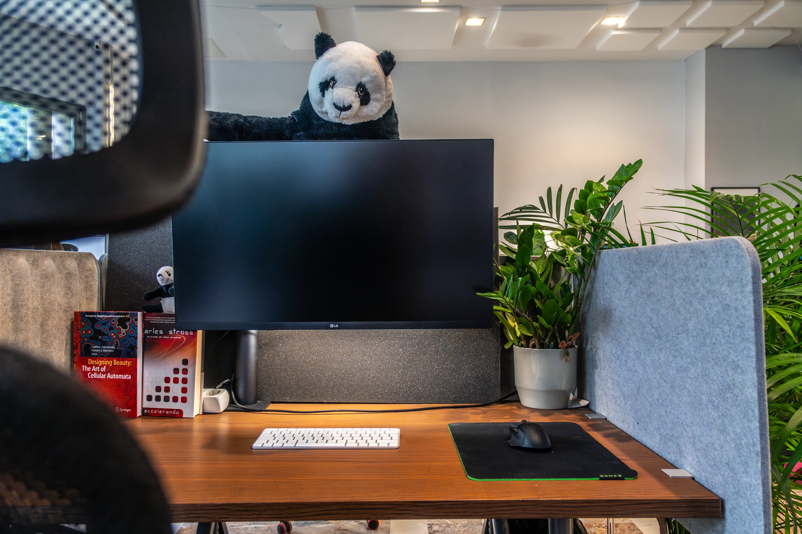
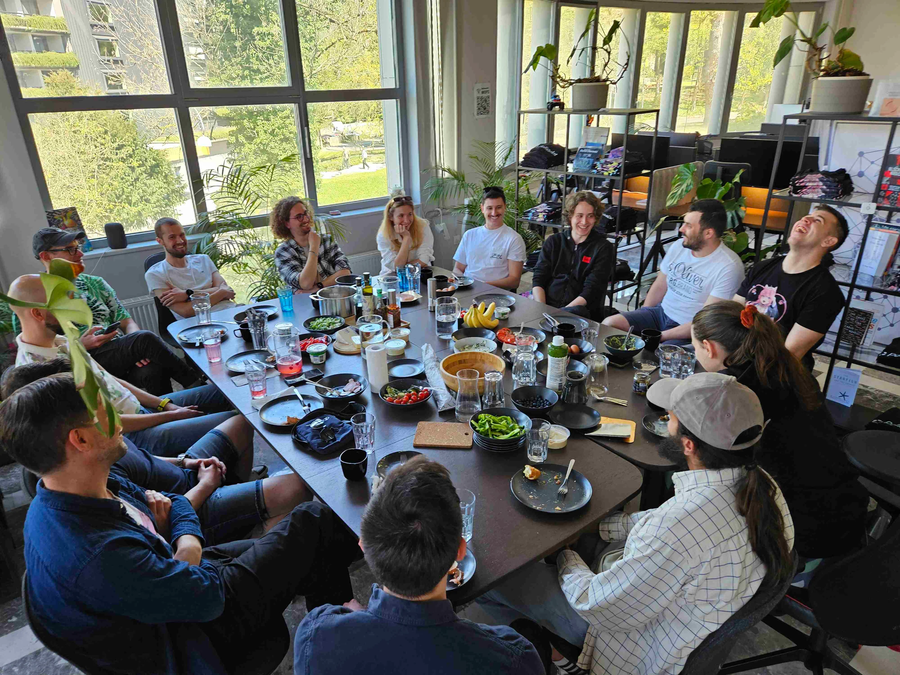

# SubWork Free Wifi

- We are more than happy offer you our **limited free wifi outside our coworking space as public good.**

- We would be more than happy [recieve 5 star review on our Google Maps location](https://g.page/r/CWs7EEKFN9-zEBM/review) as favour as we believe _our wifi helped you do some important work._
- Looking to get desk to focus on your productivity? 
- You can have a look at our [membership options](./membership.md). 

## Short stay?
- If you are looking for short stay, we are happy to **give you discount 20€ for daypass**, paying 10€ at terminal.
- Hit our [Telegram channel to ask for more details](./contact.md)
- To book for longer stay, while no one is available on site, [learn more at booking page](./book-subwork.md)

## What is SubWork?

We are minimal viable community in Julian Alps having small 200sqm coworking space with lot of natural daylight including lot of premium amenities like **external monitors, meeting room and speciality coffee gear with various beans.**

