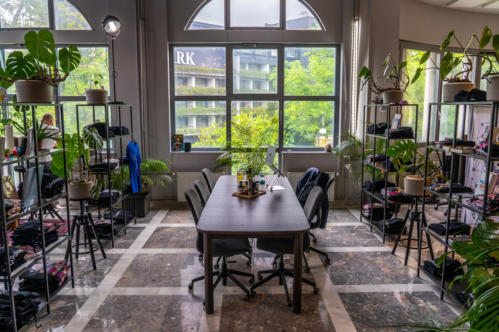
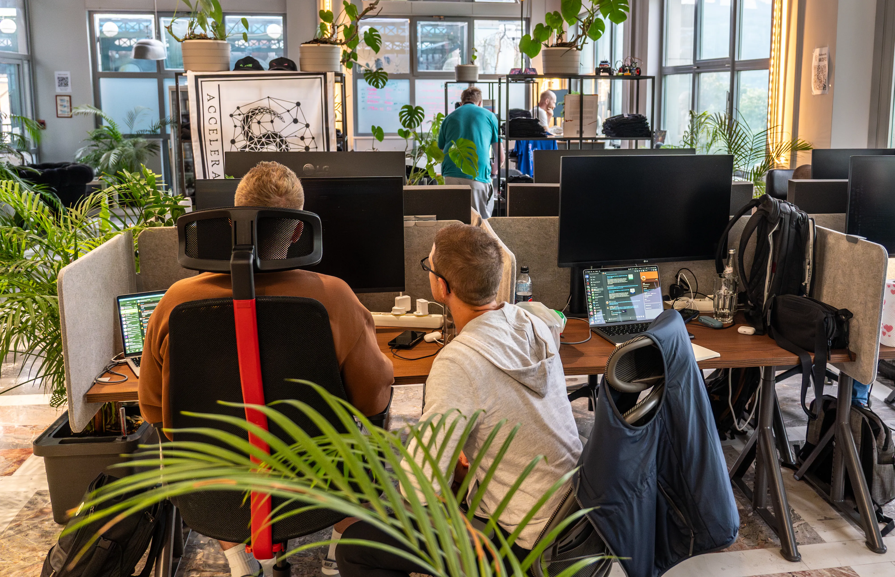
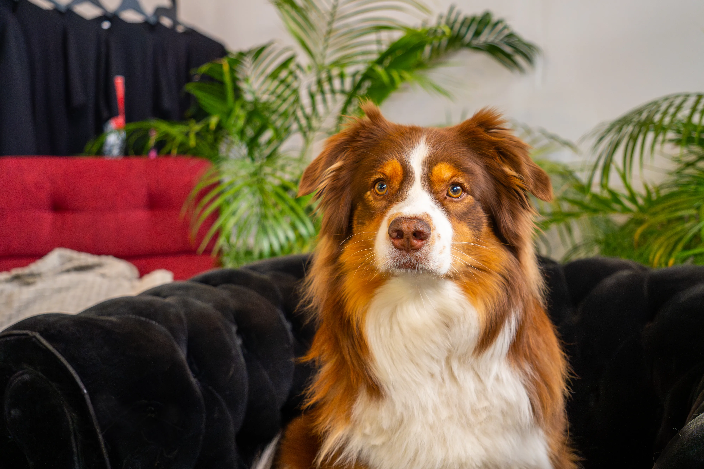
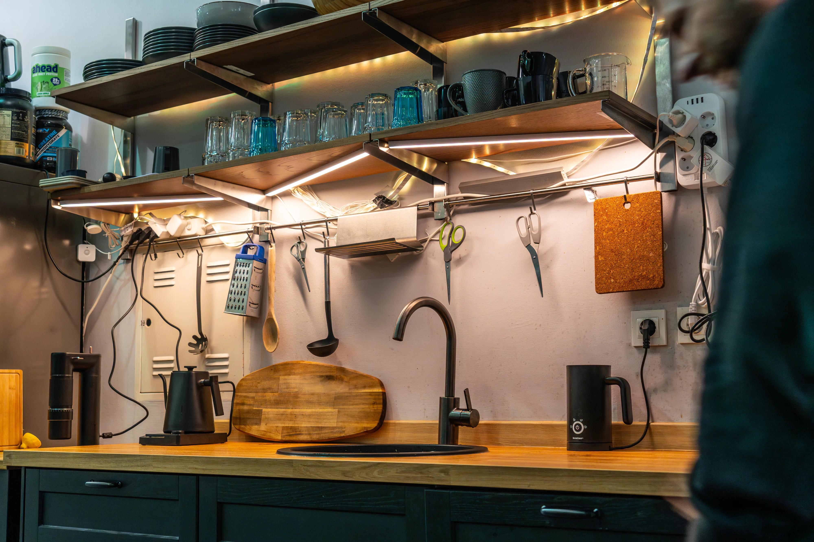
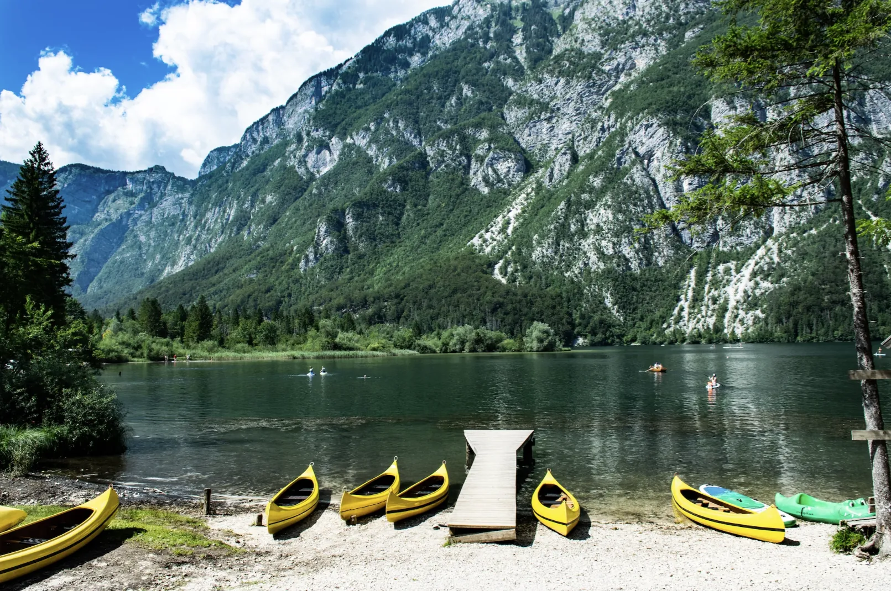

---
head:
  - - meta
    - property: og:type
      content: website
  - - meta
    - property: og:title
      content: SubWork - coworking in nature
  - - meta
    - property: og:image
      content: https://subwork.xyz/subwork_header_jungle_description.png.webp
  - - meta
    - property: og:url
      content: https://subwork.xyz
  - - meta
    - property: og:description
      content: Beautiful coworking space in the nature of Julian Alps in Bled, Slovenia
  - - meta
    - name: twitter:card
      content: summary_large_image
---

# coworking space in Bled, Slovenia <Badge type="warning" text="beta" />

> co-work space by Koda Builders **inviting web3 builders.**

- [Book SubWork](./book-subwork.md)
- [Membership pricing](./membership.md)

who builds at SubWork?
---
- [Koda](https://twitter.com/kodadot) - Generative Art Marketplace on Farcaster
   - Generative Art Frames at [Farcaster /koda](https://warpcast.com/~/channel/koda)
   - power builders with over 130 contributors in open source 
   - [top1 dapp in Polkadot](https://github.com/topics/polkadot) by Github Metrics
- [Lastic](https://lastic.xyz) - BlockSpace builders for data availability
- [📖 Learn more](./who-we-are.md) who we are

why are we at Bled?
---
- We always wanted to have a space in nature away from everything, where others could come to recharge and build their dreams in peace with like-minded athletic achievers.
- A morning workout in nature does wonders with your mind & body. 🏃‍♂️
- Beautiful scenery outside of the capital city creates mind serenity. 🚴 
- Come to realize your achievement and fulfill your dream. 💨 
- Bled has an average [annual amount of 2880 sunshine hours](https://weatherandclimate.co.uk/slovenia/lake-bled-4044834/), ☀️
   -  guaranteeing your daily mood even in winter
- [📖 Learn why Bled is an amazing place for your productivity](./why-did-we-choose-bled.md)

> view from hill Straza, 200m from SubWork

who can I meet in space?
---
- [who are family members at SubWork?](./family-members-in-subwork.md)
- we've hosted over _200 high quality builders_ in space for last two years
- day guests are coming from cities like _Zurich, Singapore, Munich, Frankfurt, Berlin, Prague, Vienna, Copenhagen, Milan_ and many more
- amounts of coworkers in SubWork in the past
  - nine co-workers in December ‘22
  - 23 co-workers in May ‘23
  - 110 co-workers summer & fall '23
- come to visit us and [join our Telegram group](./contact.md)

> SubWork mascot, australian shephard, Berry

conference capacities 👔 
---

- Do you plan to organize a more significant conference or meetup with your team? 
- [We can help with that!](./company-retreat.md)

our capabilities 🧘 
---
- We can comfortably accommodate 30 builders with comfortable seating
- [Host local tech, crypto and AI meetups, technological and art events](./rent-subwork-venue-in-bled.md)
- [We can help you with more prominent team retreats](./company-retreat.md)

surroundings 🏞 
---
Are you curious about [how it looks around Bled?](./surroundings.md)

you are an athletic soul 🏋️
---

Have a peek at [sports activities](./sports-activities-around-bled.md) you can do in proximity of SubWork

> Canoes at Lake Bohinj

museum 🏛 
---
We care about your education about local place

- [Arnold Rikli](https://en.wikipedia.org/wiki/Arnold_Rikli)
- [Bled](https://en.wikipedia.org/wiki/Bled)

options for long-term stay 🏡 
---
- We can give you recommendations on where to look for a [long-term stay](/long-term-stay-in-bled.md)
- Do you [want to do coliving?](./coliving-in-bled.md) Let's go!

