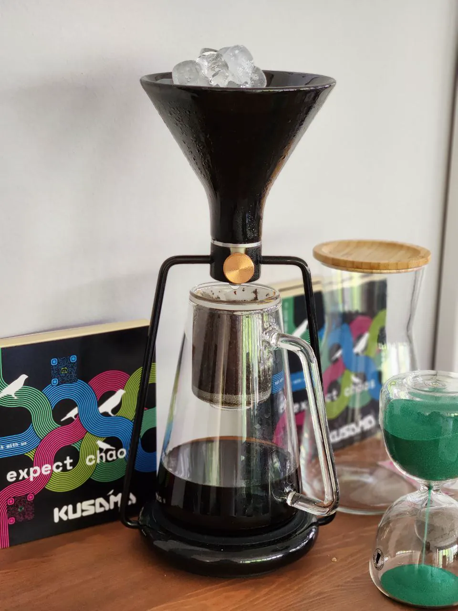

---
head:
  - - meta
    - property: og:type
      content: website
  - - meta
    - property: og:title
      content: SubWork - coworking in nature
  - - meta
    - property: og:image
      content: https://subwork.xyz/subwork_header_jungle_description.png.webp
  - - meta
    - property: og:url
      content: https://subwork.xyz
  - - meta
    - property: og:description
      content: Beautiful coworking space in the nature of Julian Alps in Bled, Slovenia
  - - meta
    - name: twitter:card
      content: summary_large_image
---

# crypto coworking space in Bled, Slovenia <Badge type="warning" text="beta" />

> co-work space by Koda Builders **inviting web3 builders.**

- [Book SubWork](./book-subwork.md)
- [Membership pricing](./membership.md)

👨‍🏭 who we are?
---
-  We are **power builders with over 130 contributors** - [KodaDot - Generative Art Marketplace](https://twitter.com/kodadot)
   - [**top1 dapp in Polkadot** by Github Metrics](https://github.com/topics/polkadot)
- We always wanted to have **space in nature away from everything**, where others could come over to **re-charge and build their dream in peace** with like-minded athletic achievers.
- We have focused on **web3** teams**
- [📖 Learn more who we are](./who-we-are.md)

> view from hill Straza, which is 200m from SubWork

🤔 why are we at Bled?
---

- 🏃‍♂️ A morning workout in nature does wonders with your mind & body.
- 🚴 Beautiful scenery outside of the capital city, which creates mind serenity.
- 💨 Come to realise your achievement and fulfil your dream.
-  ☀️ Bled has an average [annual amount of 2880 sunshine hours](https://weatherandclimate.co.uk/slovenia/lake-bled-4044834/),
   -  guaranteeing your daily mood even in winter
- [📖 Learn why Bled is an amazing place for your productivity](./why-did-we-choose-bled.md)

👩‍💻 who can I meet in space?
---

- [who is daily inside SubWork?](./family-members-in-subwork.md)
- daily amounts of coworkers in SubWork
  - 9 co-workers in December ‘22
  - 11 co-workers in May ‘23
  - 70 co-workers summer '23
- daily guests coming from cities like _Zurich, Singapore, Berlin, Prague, Vienna, Zagreb, Copenhagen, Milan_ and many more
- coming to visit us?
  - [join our Telegram group](./contact.md)

> SubWork Spring '23, merchandise shop

👔 conference capacities
---

- Do you plan to organise a more significant conference or meetup with your team? 
- [We can help with that!](./company-retreat.md)

🧘 Our capabilities
---
- We can comfortably accommodate 30 builders daily with comfortable seating
- [Host local tech, crypto and AI meetups, technological and art events](./rent-subwork-venue-in-bled.md)
- [We can help you with more prominent team retreats](./company-retreat.md)

🏞  surroundings
---
Are you curious about [how it looks around Bled?](./surroundings.md)

🏋️ you are an athletic soul
---

- Have a peek at [sports activities](./sports-activities-around-bled.md) you can do around SubWork

> Canoes at Lake Bohinj

🏛 museum
---
We care about your education about local place

- [Arnold Rikli](https://en.wikipedia.org/wiki/Arnold_Rikli)
- [Bled](https://en.wikipedia.org/wiki/Bled)

Options for long-term stay 🏡 
---
- We can give you recommendations on where to look for a [long-term stay](/long-term-stay-in-bled.md)
- Do you [want to do coliving?](./coliving-in-bled.md) Let's go!
