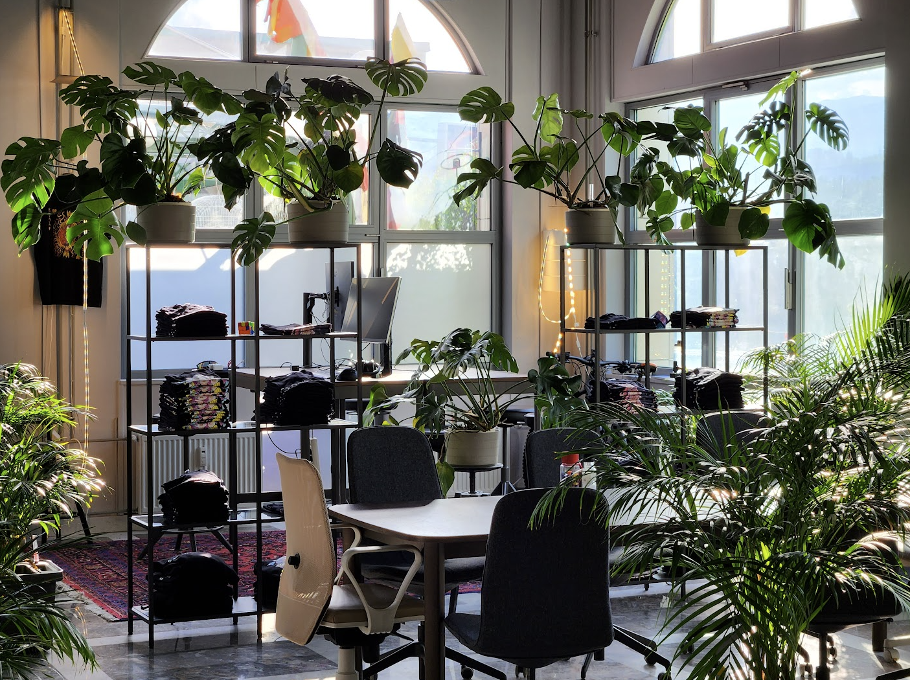

---
# https://vitepress.dev/reference/default-theme-home-page
layout: home

hero:
  name: "SubWork - web3 cowork space"
  text: "minimum viable community in Julian Alps"
  tagline: Crypto & AI hub in most beautiful nature of Slovenia, Europe
  image: 
    src: pics/subwork_colddrip.jpg
    alt: SubWork web3 jungle
  actions:
    - theme: alt
      text: why?
      link: /why-did-we-choose-bled
    - theme: brand
      text: amenities
      link: /amenities-in-coworking-space
    - theme: alt
      text: sport activities
      link: /sports-activities-around-bled
    - theme: alt
      text: mountain peaks
      link: /mountain-peaks-and-alpine-cabins
    - theme: alt
      text: surroundings
      link: /surroundings
    - theme: alt
      text: join our community events
      link: https://meetup.com/subwork/

features:
  - icon: 🏔️
    title: slovenia is most crypto friendly destination in Europe
    details: one of foundational reason having SubWork are that Slovenia is home of BTC City, Bitstamp and Elly PoS.
  - icon: 🏞️
    title: superior weather all year long
    details: beautiful cloudless winter and not so hot summer makes SubWork perfect destination for your long-term stay focusing on your productivity.
  - icon: 🧘
    title: wellbeing-first
    details: you always want to focus on your wellbeing and growth while staying sharp focused on your delivery? We are your choice!
  - icon: ☀️
    title: optimal amount of sunshine hours
    details: bled has average annual amount of 2455 sunshine hours, which guarantee your superior mood and processing power.
---

 
 
 
 
 
 

