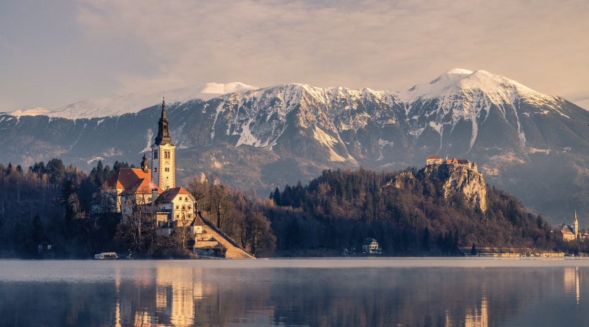
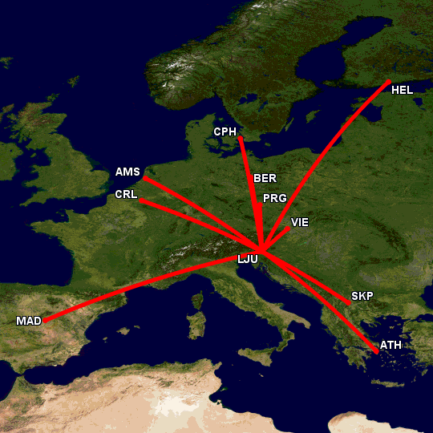
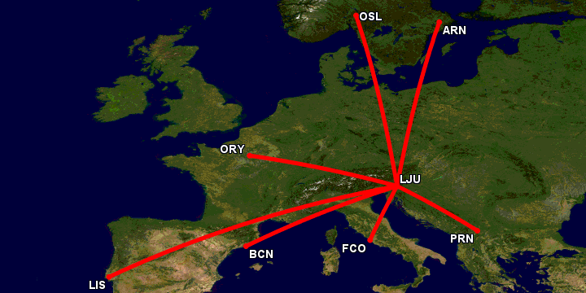

## where is SubWork located?

Bled is located 40mins from capital of Slovenia, Ljubljana. 
Currently reccomended airports for international flights are
- LJU, Slovenia
- Zagreb, Croatia
- Venice, Italy
- Graz, Austria
- Munich, Germany
- Vienna, Austria

📍 Bled, Slovenia, Europe
---

- The location is at [Bled, in the north part of Slovenia](https://goo.gl/maps/KvDbeJwVGxQM5sBS9), south eastern Europe.
- 📸 [How does Bled looks like?](https://www.google.com/search?q=bled+slovenia+beautiful+photos)

🚗  close proximity to
---

- 🏞  [Lake Bled](https://en.wikipedia.org/wiki/Lake_Bled), where co-work is based
- 🏞  [Lake Bohinj](https://en.wikipedia.org/wiki/Lake_Bohinj) — 20 min
- ⛰  [Julian Alps](https://en.wikipedia.org/wiki/Julian_Alps) — [Triglav National Park](https://goo.gl/maps/ut7PXBq7VD3DTy2k9)
- ⛰  [Karawanks Alps](https://en.wikipedia.org/wiki/Karawanks)
- ✈️  [LJU - Ljubljana Jože Pučnik Airport](https://en.wikipedia.org/wiki/Ljubljana_Jo%C5%BEe_Pu%C4%8Dnik_Airport) — 30 mins
- 🏙  [Ljubljana](https://en.wikipedia.org/wiki/Ljubljana) — capital of 🇸🇮 — 40 mins
- 🌅  [Piran](https://en.wikipedia.org/wiki/Piran) - 🌊 🏖 sea side - 90 mins

🚶‍♀️ how to get to the SubWork?
---
- [Check our transporation page](./transportation-to-subwork-bled-slovenia.md)

🗺️ location in Bled, Slovenia
---

- We are located in Trgovski Center Bled. Entrance is next to the Mercator and Kavarna Apropo.
- [Are coming by car?](./coming-by-car-to-subwork-bled.md) 

<iframe src="https://www.google.com/maps/embed?pb=!1m18!1m12!1m3!1d10632.824390225414!2d14.101336860080114!3d46.36683985844772!2m3!1f0!2f0!3f0!3m2!1i1024!2i768!4f13.1!3m3!1m2!1s0x477a9735546512eb%3A0xb3df378542103b6b!2sSubWork%20-%20coworking%20space!5e0!3m2!1sen!2ssi!4v1684324091953!5m2!1sen!2ssi" width="600" height="450" style="border:0;" allowfullscreen="" loading="lazy" referrerpolicy="no-referrer-when-downgrade"></iframe>

future of new air connections
---
Slovenia goverment is running [subsidiary of new routes to major european capitals, with 16.8M€](https://www.exyuaviation.com/2023/03/slovenia-to-outline-subsidised-air.html)

> Ten routes have been listed as of utmost priority. The first group are larger hubs that can provide onward connectivity. They include: Vienna, Copenhagen, Athens, Madrid, Amsterdam and Helsinki. The second group of destinations are those aimed at point-to-point passengers. They include: Charleroi, Skopje, Prague and Berlin. The third group of destinations, marked as “supplementary”, will only be subsidised if there are enough funds left following the first public call aimed at the abovementioned ten priority routes. The supplementary destinations include: Rome Fiumicino, Stockholm, Oslo, Barcelona, Lisbon, Pristina and Paris Orly. 

