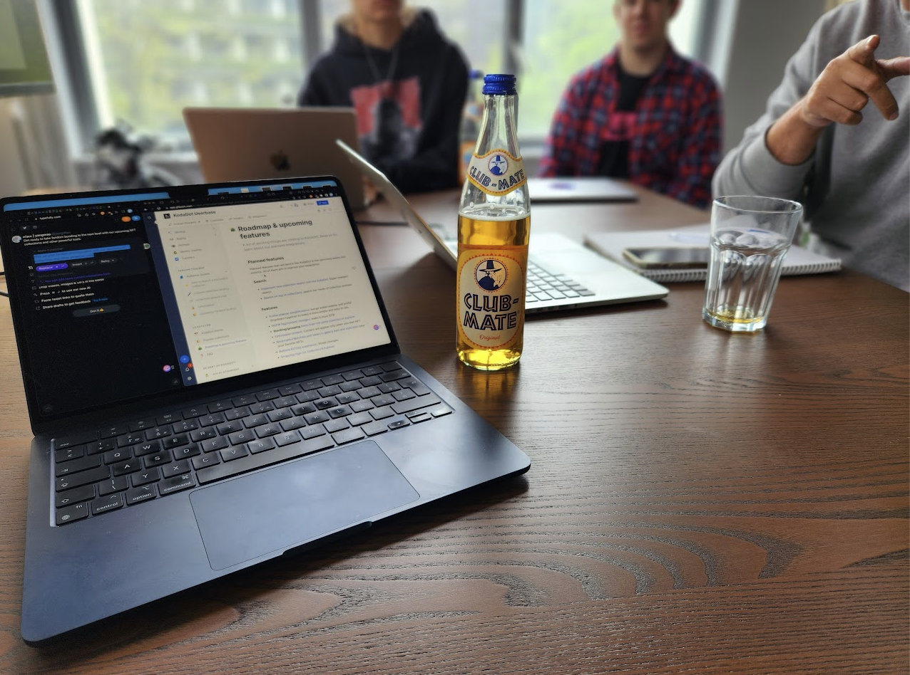
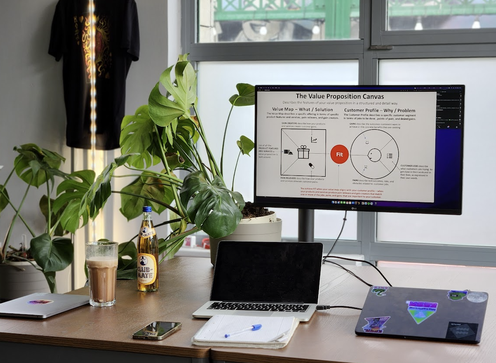
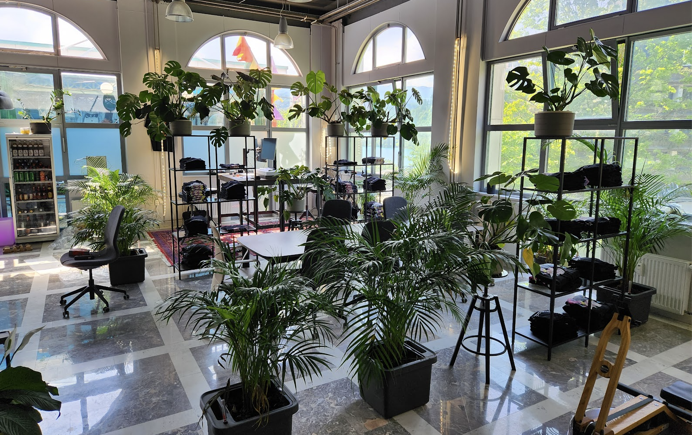

# membership in SubWork

_We are operating as non-profit and we are looking sustainably growing our space._

We are happy to give you first try out [for review on Google Maps](https://g.page/r/CWs7EEKFN9-zEBE/review), to explore cowork. 

If we are coworking you've been looking for. However as operating bussines _we need to cover our investments, running costs as rent and day-to-day resources_, like maintain accessible and clean space for everyone.

daypass
---
- We are happy to give you first try out for first review on Google Maps to let you explore, if it's fitting coworking you've been looking for.
- [Google Maps ⭐️ Review](https://g.page/r/CWs7EEKFN9-zEBE/review)

weekpass
---
Coming to Slovenia to enjoy your stay for sport activity, relax and you need place to focus for your writing? Perfect fit for you. 
- Available desk in space
- Enjoy insider experience
- You can participate on regular breakfasts organized by members
- 70€ / week

flex desk
---

- Are you living near, however at home you are bored as one or have lot of distractions from kids? We are your place to go.
- You have guaranteed table
- You'll get temporary key
- You can participate on regular breakfasts organized by members
- 200€ / mo

fix desk
---

- Early bird, fresh startup founder with raised money need place to focus? Having revenue from your AI GPT startup? We are your place number one in Slovenia to have right peer group help you 10x your revenue.
- Own Plant on your table
- Option to have 160cm desk if available in space
- 24/7
- 300€ / mo

meeting rooms
---
In SubWork we offer three meeting rooms with privacy for your work, collaboration and accoustic insulation.
- [📖 Learn more about meeting rooms in SubWork, Bled](./book-meeting-room-bled.md)

rent venue for your event
---

- Want to rent SubWork? Let us know, price start at 500€/day. 
- Are you NGO, non-profit or students organization? We can offer you friendly discount.
- [📖 Learn more](./rent-subwork-venue-in-bled.md)

payment options
---
We accept payment by credit card in space, cryptocurrencies via partners and wire transfers. 
However we love untracable cash, we don't hold it in space and we can't give you change.

invoicing
---
In terms of invoicing we can issue you invoice on our Slovenian company and you can put it as expense in your accouting. This is only available for flex desk, fix desk and meeting rooms from up 3h.

pricing tl;dr
---

| Tier | Capacity | Unit price € | 
| --- | --- | --- | 
| First Try | 20 | Google Maps & Coworker Review  
| Daypass | 20 | 20 
| Weekpass | 20 | 70 
| Bi-week pass | 20 | 120 
| Flex Desk | 6 | 200 
| Fix Desk | 4 | 300 
| Meeting Room Kusama | 1 |  50/h 
| Meeting Room Polkadot | 1 | 50/h
| Rent Venue day | 1 | 500
| Rent Venue evening | 1 | 300/3h
| Private Office | 1 | 1200/mo
