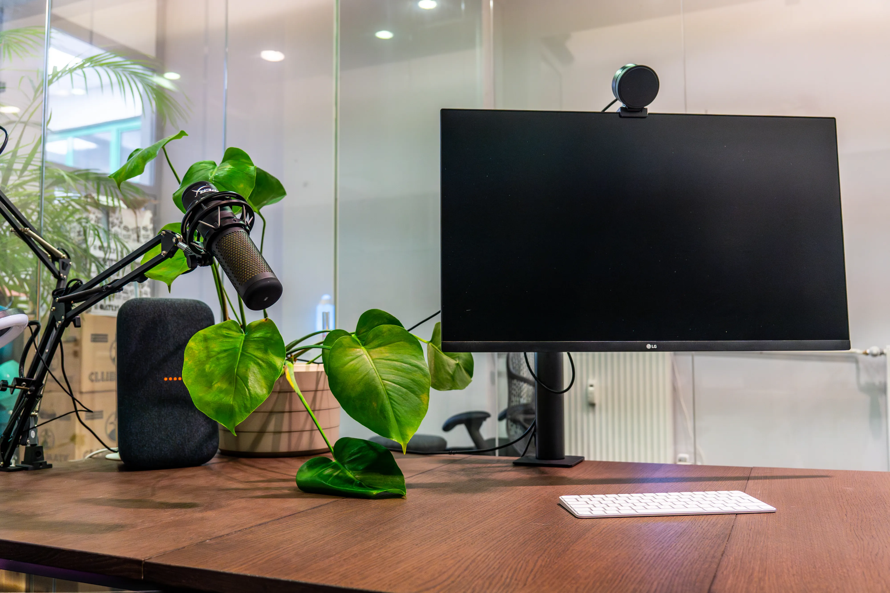
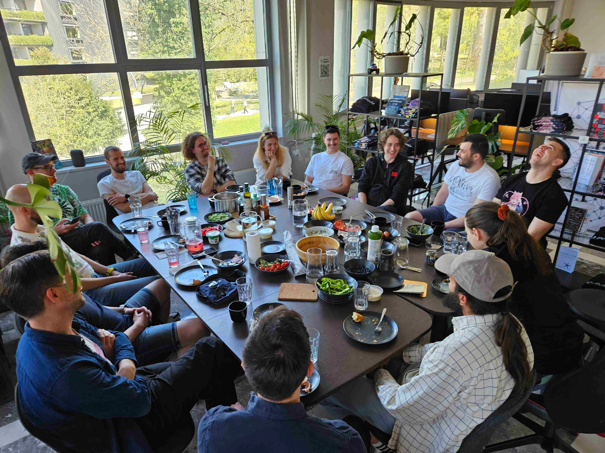

# membership in SubWork

Operating as a non-profit _we want to cover our investments, running costs such as monthly rent, day-to-day resources_ to maintain accessible and clean spaces for everyone.

daypass
---
- 30€ / day
- we are happy to give you a discount 20€ [for review on Google Maps](https://g.page/r/CWs7EEKFN9-zEBE/review) to explore coworking space. 

weekpass
---
are you coming to Slovenia to enjoy your stay for sports activity and do you need a place to focus on your work? It is a perfect fit for you. 
- available desk in space
- enjoy insider experience
- you can participate at regular breakfasts organized by members
- 100€ / week

flex desk
---
you are living near by, but at home, you are bored or have a lot of distractions from kids. We are your place to escape and being productive.
- guaranted table
- you'll get a temporary code
- you can participate in regular breakfasts organized by members
- 300€ / mo

fix desk
---
- early bird, fresh startup founder with raised money need a place to focus and grind? Have revenue from your AI GPT startup? We are your place number one in Slovenia to have the right hustle group to help you 10x your revenue.
- own a plant on your table
- option to have 160cm desk if available in space
- 24/7 access
- 400€ / mo

coming as a group for team retreat?
---
we know that team retreats have a doable effect on team morale to change the working environment. We are happy to accommodate your needs depending on our operating capacity. We are happy to give you a group discount for your team. 
Ask on our Telegram chat for more

meeting rooms
---
In SubWork, we offer three private meeting rooms for your team work. With focus on collaboration and acoustic insulation.
- [📖 Learn more](./book-meeting-room-bled.md) about meeting rooms in SubWork

rent venue for your event
---

- Want to rent SubWork? Let us know, the price starts from 1200€/day. 
- Are you an NGO, non-profit, or student organization? We can offer you a friendly discount.
- Renting for a longer period is eligible for discount.
- [📖 Learn more](./rent-subwork-venue-in-bled.md)

portfolio companies
---
special discount for portfolio company from particular VCs. Ask at Telegram for more information. 

payment options
---
We accept payment by credit card in space, cryptocurrencies via partners, and wire transfers. 

[📖 Book membership in SubWork](./book-subwork.md)

invoicing
---
we can issue you an invoice from our Slovenian company, which you can put as an expense in your accounting. _This is only available for fixed desks, renting venue and meeting rooms from up to 6 hours_.

pricing for SubWork coworking passes
---

| Tier | Unit price € | 
| --- | --- | 
| Day pass | 30 
| Week pass | 100 
| Two weeks pass | 180 
| Flex Desk | 300/mo 
| Fix Desk | 400/mo
| Meeting Room L2 | 50/h 
| Meeting Room L1 | 50/h
| Rent Venue evening | 500/3h
| Rent Venue day | 1200/day
| Private Office | 2000/mo
| Sponsorship Tier C | 3k/mo
| Sponsorship Tier B | 5k/mo
| Sponsorship Tier A | 10k/mo 
