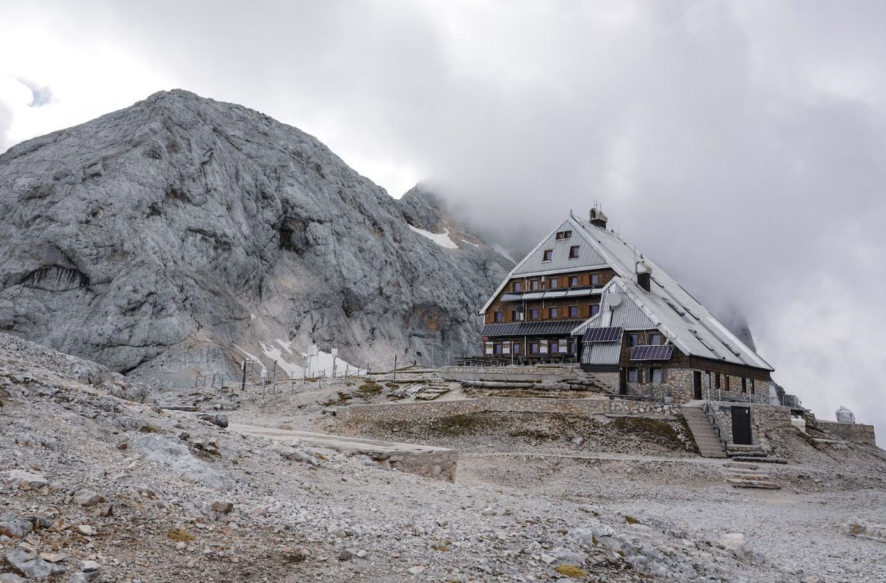
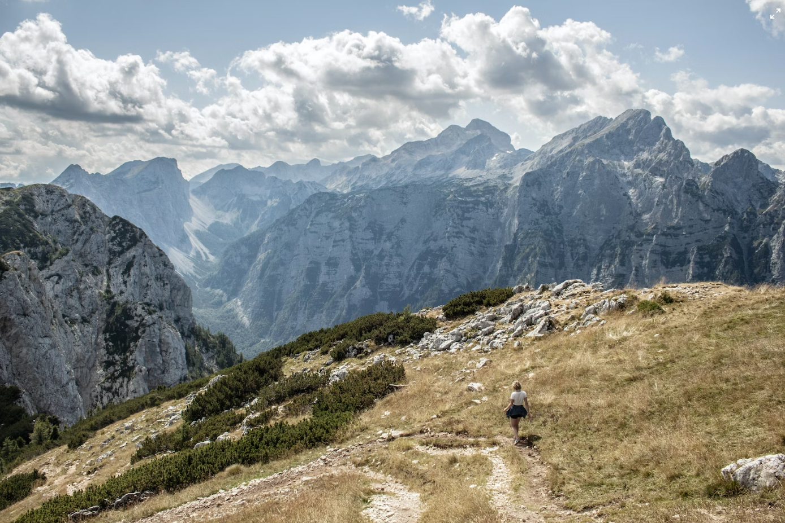

Mountain peaks around Bled, Bovec and Kranjska Gora
---

As we are in Julian Alps, there are lot of popular hiking routes to explore various hidden scenic views on various elevated fields between peaks with beautiful lakes. We cherry picked list of most popular spots around. All together it's hike program **for more than one month**, even for great mountaineers.

Popular Mountain Peaks 
---
- Triglav - 2864m
- Skrlatica - 2740m
- Debela Peč - 2014m
- Stol - 2236m
- Peč (Tromeja) - 1503m
- Golica - 1835m
- Begunjščica - 2060m
- Pršivec - 1761m
- Krn - 2244m
- Ratitovec - 1666m

Mountain huts and Alpine pastures
(planinske koče in planine)
---

- TRIGLAVSKI DOM NA KREDARICI (2515 m)
- DOM PLANIKA POD TRIGLAVOM (2401 m)
- BLEEKA KOCA NA LIPANCI (1630 m)
- DOM NA KOMNI (1520 m)
- ROBLEKOV DOM NA BEGUNJŠČICI (1657 m)
- KOČA NA DOBRČI (1478 m)
- KOČA NA TALEŽU (725 m)
- PLANINA JAVORNIK (1300 m)
- PLANINA USKOVNICA (1200 m)
- PLANINA KOFCE (1488 m)

