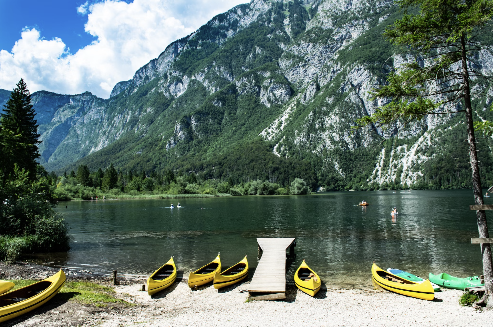
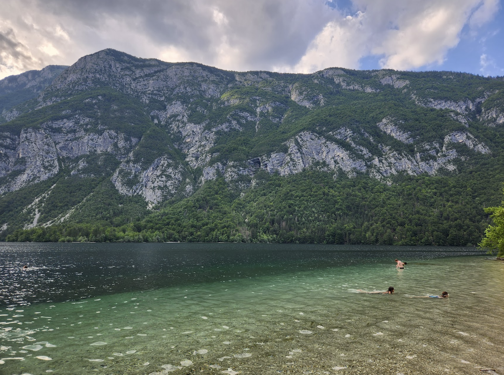
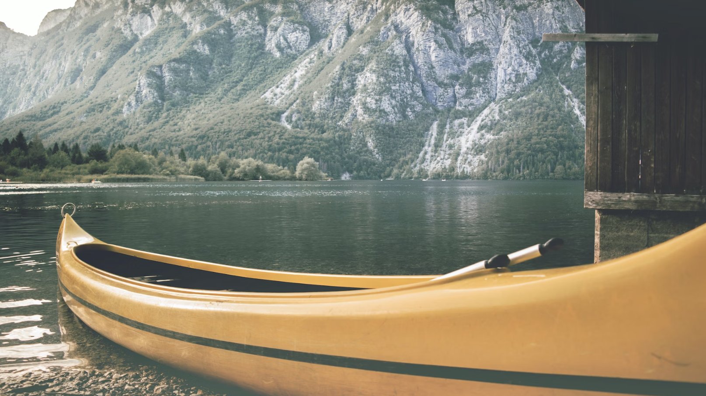

# Rent Stand-up paddle on Bled and Bohinj

Among [many places where you can SUPing in Slovenia](https://www.slovenia.info/en/stories/top-locations-for-standup-paddleboarding-in-slovenia), **Bled and Bohinj are most scenic ones**.

There are few places where you can rent sup for you and your team

Bohinj
---

At Famous Bridge [you can rent a boat](https://goo.gl/maps/xpZBQ9aYntUy2wmY7)

- https://escapetobohinj.com/things-to-do-bohinj/hire-kayak-canoe-sup/
- http://letspaddle.si/sup_bohinj_lake.php

Naklove Glave
---
I'ts popular beach [in the middle of lake Bohinj and dive site too](https://h2oglobe.com/location/9a9e80d3-08d4-4a4c-a84b-3ed6a0cafb18/bohinjsko_jezero_pri_naklovi_glavi). 
[Check underwater atlas of life there](http://antena.fe.uni-lj.si/literatura/SPZ-PAS/pdf/052_Naklova.pdf)

Our favourite provider for standup paddles are [girls from Super Duper, give them call 🤙 +38651662406](tel:+38651662406) or [+386(0)41554649](tel:+38641554649). One of them always works! 
Below are their beautiful infographics.

Suggested Tours
---
Super Duper offers guided tours on lake Bohinj. On your own we suggest Naklove Glave and go on shore on other side. Naklove Glave -> Famous Bridge is approximately 90min of paddling, ~ 4km along beautiful lake coast with enough time to wander under-water life. Camp Zlatorog -> Naklove Glave is shorter one. 

Camp Zlatorog
---
You can get Canoes in [Camp Bohinj](https://goo.gl/maps/qycTo4tjGgroAZWN9)

Bled
---

- https://www.supbled.com/
- https://www.tripadvisor.com/Attractions-g274863-Activities-c61-t270-Bled_Upper_Carniola_Region.html
- https://supbled.si/
- https://www.bananaway.eu/

