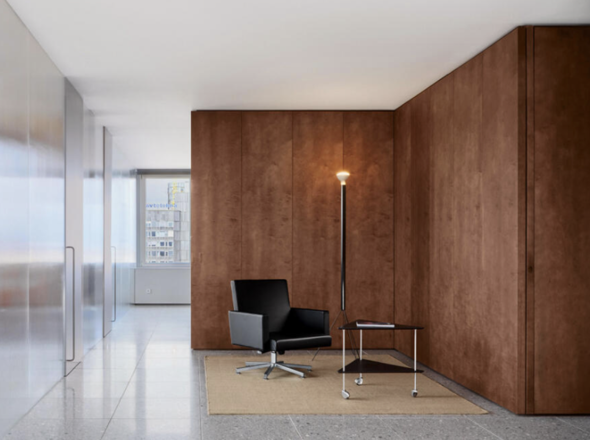
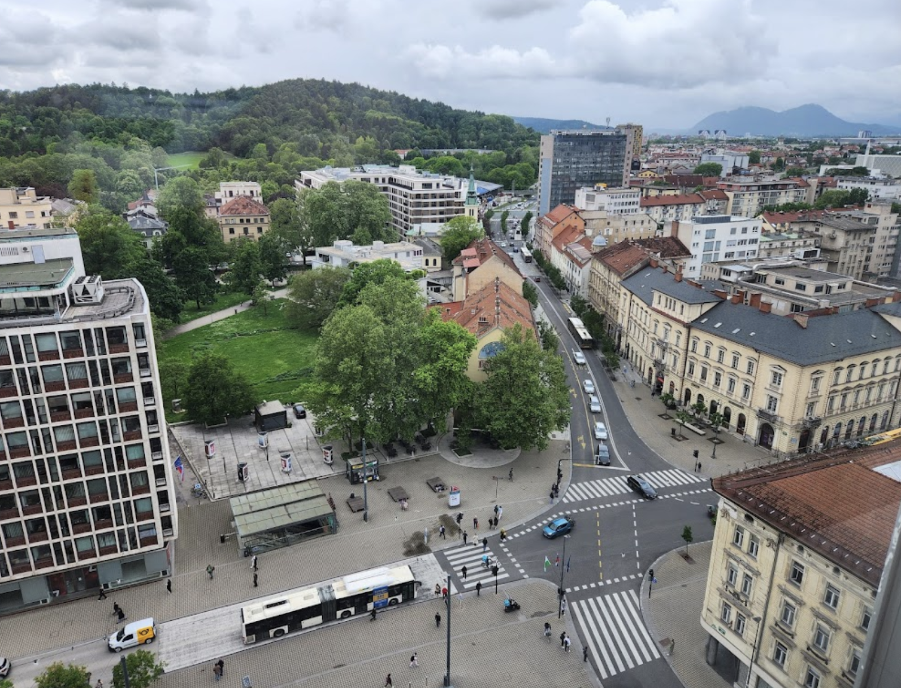
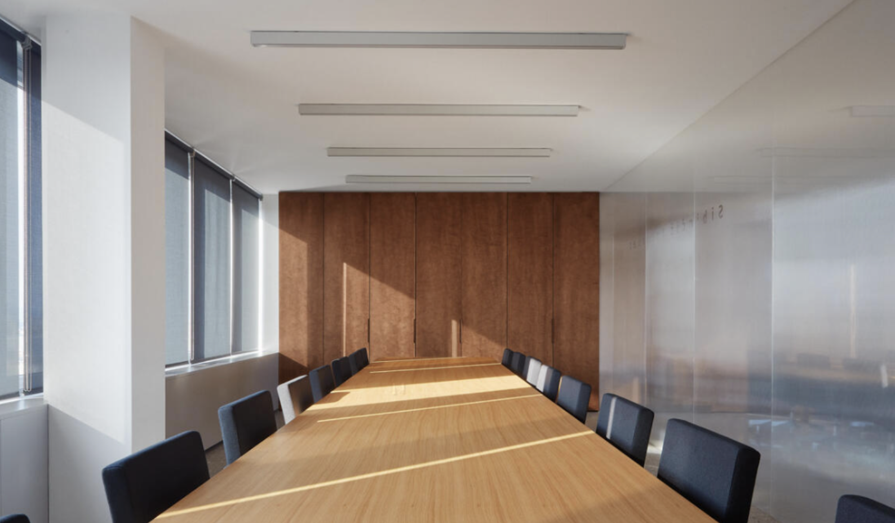
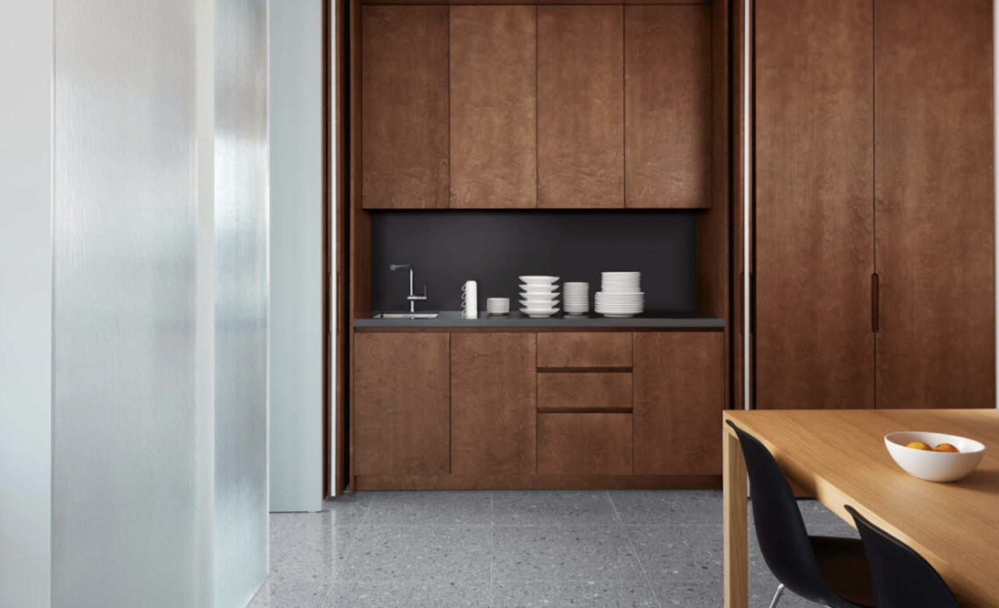

# SubWork Metalka - Ljubljana

We feel confident SubWork at Bled is popular among international companies which demonstrated hosting over 200 high signal people. As it gets fuller each day, we want to make bold move to bring our culture to Ljubljana and help expand local startup culture.

Floor blueprint
---
We talk about 14 private spaces, where 6 of them are already booked. With bigger bar in the middle for social hangout area with speciality coffee gear, common luxurious amenities including well equiped kitchen, 4 toilets and one shower backed by 2 Gbit Internet for high quality calls with your partners and remote teams. Everything underlined with beautiful view over capital Ljubljana.

Indicate your interest
---
You are freelancer or early stage company and you are geniunely interested in flexible terms for desk or private office, you can indicate us your non-binding interest following to [fill up SubWork - Metalka form](https://form.subwork.xyz/metalka). We will try to get back to you as soon as possible. 

Opening dates
---
Now it's phase of excesive demand. When we will cross internally set theashold of binding interest, we can open space effectively in three weeks from that point onwards. It's up to you spread word among your friends and replicate great culture SubWork built at Bled into Ljubljana and boost local startup ecosystem. We have experts who been around coworking bussines for past decade in Europe.

Location
---
It's [top notch premium location](https://maps.app.goo.gl/CNQXKvvEhyKPP68F9) in the [center of Ljubljana at Dalmatinova ulica 2](https://architectuul.com/architecture/metalka). Majority of premium restaurants are in walking distance, lot of room to park bikes in the space. Securing car parking is possible in near garages with plenty of capacity. Location is within proximity of 16 EV chargers. 