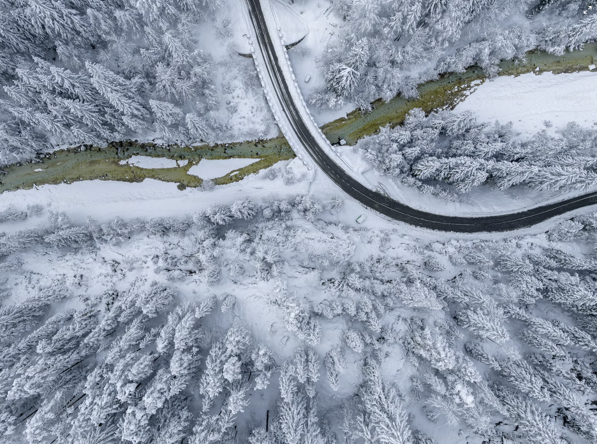

# 🛫 Transportation to Bled, Slovenia 🏔️

## 🌍 Flights to Close Proximity Cities

- **Venice** 🇮🇹: [GoOpti](https://www.goopti.com/sl/) offers transport services. Journey takes about 3 hours by car. Distance: 278 kilometers or 172.7 miles. 💰
- **Ljubljana** 🇸🇮: An easy drive or bus ride. Journey takes about 1 hour. Distance: 54 kilometers or 33.5 miles. 💰💰💰
- **Munich & Salzburg** 🇩🇪🇦🇹: Take a train to Villach, then to Lesce-Bled. Journey takes about 6 hours from Munich and 4 hours from Salzburg. Distance: 383 kilometers or 238 miles (Munich), 220 kilometers or 136.7 miles (Salzburg). 💰💰💰
- **Zagreb** 🇭🇷: Drive or take a train (approximately 2 hours). Distance: 207 kilometers or 128.6 miles. 💰💰
- **Klagenfurt** 🇦🇹: A short journey by train or car. Journey takes about 1 hour. Distance: 78 kilometers or 48.5 miles. 💰💰
- **Graz** 🇦🇹: A bit further away, but accessible by train or car. Journey takes about 2.5 hours. Distance: 222 kilometers or 137.9 miles. 💰💰💰

## ✈️ From the Airport (Ljubljana Jože Pučnik Airport) to Bled
About 36 kilometers or 22 miles

- **Bus** 🚌: Buses depart from the airport to Bled six times daily (9am, 10am, 12pm, 1pm, 4pm, 5pm). You can find the timetable [here](https://www.ap-ljubljana.si/en/timetable?departure=11917&destination=8869). 💰
- **GoOpti Transfers** 🚐: An affordable option but remember to book well in advance. Check out their services [here](https://www.goopti.com/sl/). 💰💰
- **Electric Car Rental** 🚗⚡: [Avant2Go](https://avant2go.si/) offers electric affordable car rentals. If you're interested in renting an electric car, be sure to fill out the necessary documents at least 24 hours before your flight. 💰💰
- **Taxi** 🚕: An affordable taxi ride to Bled should cost less than 60 euros. You can book a taxi from [Taxi Metro](https://www.taximetro.si/). 💰💰💰

## 🚍 From Ljubljana to Bled
About 54 kilometers or 33.5 miles.

- **Bus** 🚌: Buses from Ljubljana to Bled (and vice versa) depart every hour from 5am to 9pm. You can find the timetable [here](https://www.ap-ljubljana.si/en/bus/Ljubljana%20avtobusna%20postaja-to-Bled). 💰
- **Prevozi.org** 🚗: [prevozi.org](https://prevoz.org/) is a Slovenian website, where car drivers can post
their listings. 💰
- **Train** 🚂: You can take a train to Lesce and then walk to Bled (2km). Total duration: Approximately 1.5 hours. 💰💰
- **Electric Car Rental** 🚗⚡: [Avant2Go](https://avant2go.si/) offers electric car rentals. Remember to fill out the necessary documents at least 24 hours in advance. 💰💰
- **Taxi** 🚕: An affordable taxi ride should cost less than 60 euros. You can book a taxi from [Taxi Metro](https://www.taximetro.si/). 💰💰💰

## 🚉 From Villach to Bled
About 39 kilometers or 24 miles

- **Bus** 🚌 : Buses depart from the airport to Bled six times daily (9am, 10am, 12pm, 1pm, 4pm, 5pm). You can find the timetable [here](https://www.ap-ljubljana.si/en/timetable?departure=11917&destination=8869). 💰
- **Train** 🚂: You can take a train to Lesce and then walk 2km to Bled (total duration: approximately 1.5 hours). 💰💰

You can find additional information about this route [here](https://www.rome2rio.com/map/Villach/Bled).

## 🛩️ Private Plane and Helicopter Rental

You can rent a private plane or helicopter from [Aeroaffaires in Lesce Bled](https://aeroaffaires.com/private-jet-hire-destination/lesce-bled/). 💰💰💰💰💰

---

For more information on bus services, check out the [Ljubljana Bus Station website](https://www.ap-ljubljana.si/en/bus/Ljubljana%20avtobusna%20postaja-to-Bled).
Please note that the price scale (💰) is an estimation. Prices can vary depending on the season, service provider, and other factors. Always check the current prices with the service provider.