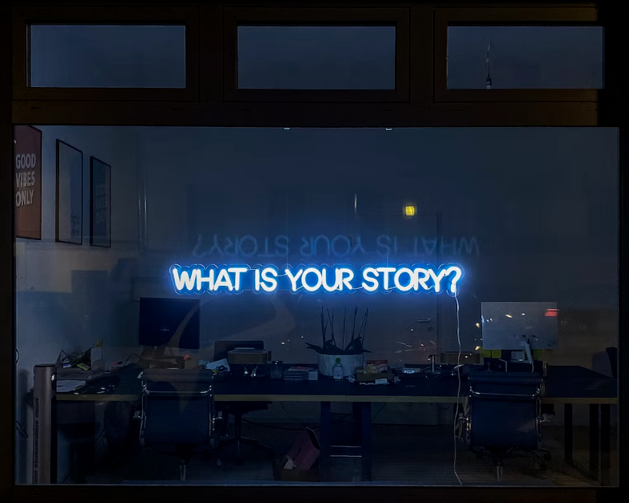

# Writings about SubWork

Do you want to share experience in SubWork with others? 

You are more than welcome to do so and gain exposure you've been experiencing SubWork among first!

List of articles we have about SubWork
---
- [Why SubWork Bled?](https://luuu.substack.com/p/why-subwork-bled)
- [Do standing desks actually help you?](https://medium.com/@poppyseedDev/do-standing-desks-actually-help-you-822ceb3d0c20)
- [Culture at SubWork](https://medium.com/@poppyseedDev/culture-at-subwork-%EF%B8%8F-593cdfa4f27f)
- [Training Berry, The Barky Australian Shepherd: A Journey of Paw-sitive Change](https://medium.com/@poppyseedDev/from-noisy-neighbor-to-%EF%B8%8F-perfect-running-buddy-my-journey-with-an-australian-shepherd-cad97bbb8fc5)