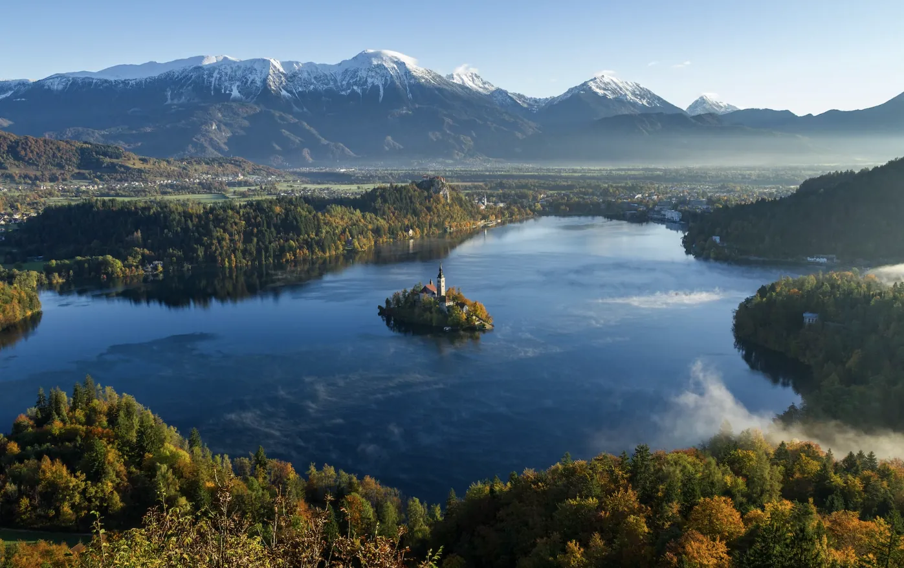
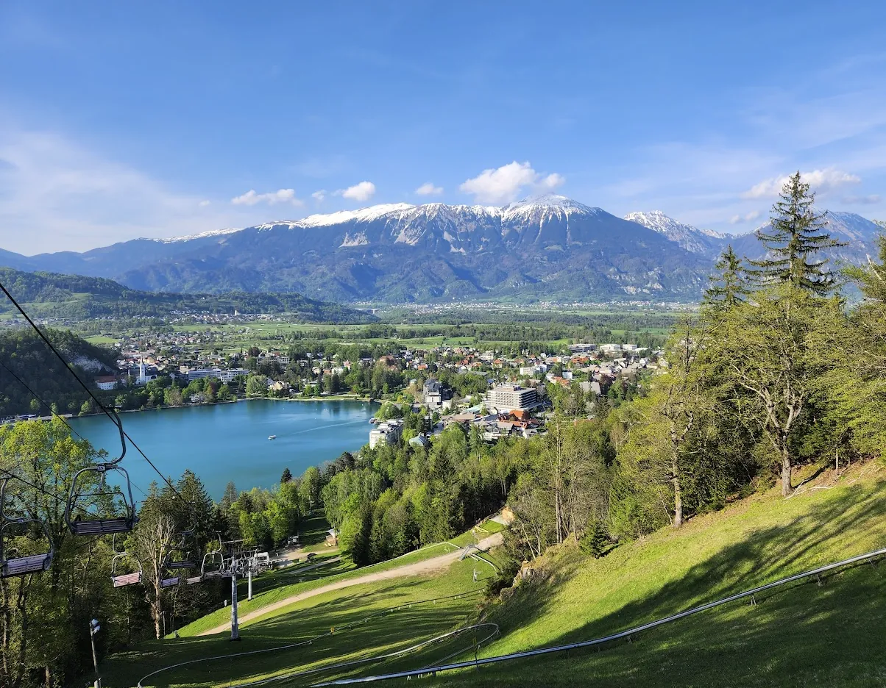

# ZuBled
#### magical stay in Julian Alps

We've tapped in Julian Alps with SubWork in April 2022 to demonstrate possibility of long-term pop-up community to exists wrapped around aligned values, middle of nowhere. 

After two years, we would like to **celebrate significant milestone as culmination of hosting over 200 high quality inviduals.** 

We are toying with idea to setup up 2-6 week long Zuzalu themed pop-up village in magical Julian Alps. Among expected tracks we are looking to have emphasis on **Longevity, Hard & Deep Tech and Network States**.

Dates
---
- We are eyeballing range mid of September 2024 - mid of October 2024
- Right between [Zuitzerland](https://www.zuzalu.city/dashboard/eventview/about?event_space_id=58465703-768b-4138-92d5-1453416a901e) and [ETHLisbon 18-20th October](https://x.com/ETHLisbon/status/1760379799673946553)
- Why those dates? Most of accomodation would be relaxed off-seasson as **Bled is small village of 8k citizens which transforms into small capital with over [1M bookings over year](https://www.bled.si/en/information/business-pages/statistics/)**, mostly during summer. Lot of families are incentivized enjoy tranquil nature and surroudings. 

Tracks
---
- Longevity - Health & Bio - nutritional science, biohacking, practical & philosophical aspects of well-being
- Decentralized Science - 
- Real-world crypto - Zero-Knowledge tech, protocol research, practical real life application
- Network States - new towns & cities, governance, collective intelligence, culture
- Aritifical Intelligence & Cyber Defense - Compute & Geopolitics, value alignment, decentralized AI
- Space Tech & Techno-Optimism - 

Size
---
- As **we are aiming 2-6 week full of nature exploration, peer-knowledge sharing and in-person lectures**. 
- We aim for 70 long-term stayers and approximately 100 short-term visitors with an average 4 days stay participants
- We have [dozens available venues](https://www.bled.si/en/meetings/meeting-planning/venues/) in walking proximity of SubWork less than <1 minute. 

Venues
---
- SubWork - primary shilling point, can comfortably host 70 folks at once
- Open air rooftop near SubWork - 100+
- Coffeeshop Apropo next to SubWork
- Schedule depended - Lovec panorama room (70+70) and Kompass conference room (90+)

Brief agenda
---
- During the week: After a healthy breakfast, you’ll spend the daytime in deep work. We provide infrastructure for you to be productive, whether you need a day of focus or want to run a retreat for your team or in a specific topic area. You will be in a beautiful place to work without having to worry about logistical details.
- In the evenings: There will be activities and opportunities to meet people, such as salons corresponding to that week’s theme and group bike rides in the surrounding Alpine country.
- Each weekend: We'll host unconferences on a variety of topics organized by relevant experts. At this point, the week-long participants will be joined by shorter-term visitors, injecting fresh energy into the popup village.
- By who: The village will be filled with high-agency people who are building towards this type of future: founders, scientists, urban planners, researchers, engineers, philosophers, storytellers, and beyond. We look for thoughtful people who are brilliant, curious, and kind.

Inspiration for ZuBled
---
Zuzalu shares elements of this vision. Its original instantiation was a 2-month popup village in a small beach town in Montenegro in 2023, which brought together 1,000+ people interested in a solarpunk future. The topics of focus were varied—crypto, longevity, AI, network states & new cities, zero-knowledge—and the unconference format focused on collective learning, collaboration, and building new frontier tech. The success of this event inspired dozens of similar projects, including [ZuConnect](https://www.zuzalu.city/), [Vitalia](https://vitalia.city/), [Mu](https://the-mu.xyz/), and many others [Zuzalu events upcoming](https://www.zuzalu.city/dashboard/home)

Who is organizing ZuBled?
---
Core organizators include, but not exclusive 
- [SubWork](https://warpcast.com/~/channel/subwork)
- [yangwao](https://t.me/yangwao), [FarCaster](https://warpcast.com/yangwao), [X](https://twitter.com/yangwao)
- [damsky](https://t.me/damskyftw), [FarCaster](https://warpcast.com/damsky), [X](https://x.com/damskyftw)
- we are looking for volunteers willing to help and gain experience
- people aligned on values of network states, being brilliant, curious and kind.
- do you want to be part of organizators team? Reach out our [**SubWork reception group**](https://t.me/+VoZsr7MEds84ZjQ0)

Want to be part of ZuBled?
---
You are always welcome to join our [**SubWork reception group**](https://t.me/+VoZsr7MEds84ZjQ0) and ask curious questions you might have ahead. 

Tickets
---
We are trying establish price per ticket as we would like comfortable cover running costs of facilities and spread equally. 

Want to organize your track?
---
We are generally want to help you setup your own track up and running with on-site help of volunteers

Sponsors
---
We are open for sponsorships

Internet on site
---
We are backed by 1Gbit fiber (expandable for 2Gbit) with Ubiquiti coverage with optional rooftop coverage and back-up 5G LTE. Few operators in Slovenia offers 150G data plan for 15e.

Experiments
---
- Objectively measure individual reaction to various types of nutrition with GCM 
- Cerebrolysin - subjective cognitive testing
- Triathlon - Various runs, enhancing personal endurance, like [JAT LAKE BLED](https://trailrun.si/en/80km-en/)
- Sleep testing - peer group to measure quality of sleep, impacts, improvements and sharing learnings
- Daily cold plunge - at Lake there is highlikely chance assembly group of 10-15 who would be steadily taking lead to organize morning cold plunges. There is option do it at beautiful alpine river. 

Concept of aligned community living in Bled
---
> Imagine living in a small town within walking distance of friends, family, and people you admire.

> On your way to the coworking space, you run into your favorite author in the town square. After a productive morning, a friend a few desks over invites you on a walk to brainstorm a hackathon project.

> Then, at dinner, everyone gathers for a healthy meal grown just over the hill. The mayor pops in to share an update on the upcoming art festival, alongside a jam-packed weekend on the latest in AI and Biotech.

Ref
---
- [Concept](https://x.com/devonzuegel/status/1538723835947589632)
- [SubWork Fellowship](./subwork-fellowship.md)
- [Zuitzerland/ZuLead/Davoz](https://www.daovoz.org/), [1](https://checker.gitcoin.co/public/project/show/zulead-by-daovoz)
- [ZuVillage Georgia](https://zuvillage-georgia.framer.website/)
- [EdgeEsmeralda](https://www.edgeesmeralda.com)
- [Una Wang, Isla Munro Hochmayr - Living in the age of crypto tribalism: learning from Zuzalu](https://www.youtube.com/watch?v=uKnYsPfV9Co)
- [Zuzalu Q1-Events Round](https://checker.gitcoin.co/public/round/XAvgyqJ2N/show) 
